# SMDH Data Layer Design - Working Document

## Executive Summary

This document outlines the design for extending the SMDH Snowflake data platform to support advanced manufacturing analytics dashboards powered by ML-driven insights. The design leverages the existing multi-tenant architecture while adding new capabilities for:

- Machine state classification (OFF/IDLE/WORKING)
- Production event detection and clustering
- Energy and cost analytics by state
- Anomaly detection and quality monitoring
- Real-time OEE-lite calculations
- Environmental monitoring (HAVEN integration)

## Current State Analysis

### Existing Infrastructure
1. **Multi-tenant Snowflake setup** with isolated databases per tenant
2. **Data ingestion pipeline**: AWS IoT → Kinesis → Snowflake (via Openflow)
3. **Schema layers**: RAW → NORMALIZED → AGGREGATED → ANALYTICS
4. **Real-time processing**: Streams, Tasks, and Dynamic Tables
5. **Current sensor focus**: Temperature, humidity, pressure, generic metrics

### Gap Analysis

| Required Capability | Current State | Gap | Priority |
|-------------------|--------------|-----|----------|
| Power/current measurement | Generic sensor_metrics | Need specific power calculations | HIGH |
| Machine state classification | Not implemented | Need GMM-based classification | HIGH |
| Production event detection | Not implemented | Need state-based event extraction | HIGH |
| Product clustering (DBSCAN) | Not implemented | Need cycle time clustering | HIGH |
| Energy cost calculation | Not implemented | Need tariff integration | MEDIUM |
| Vibration/condition monitoring | Generic sensor support | Need specialized processing | MEDIUM |
| Environmental zones | Site-level only | Need zone mapping | LOW |

## Design Approach

### 1. Layered Data Architecture

```
┌─────────────────────────────────────────────────────────────┐
│                    User Dashboards (Streamlit)              │
├─────────────────────────────────────────────────────────────┤
│                    Analytics API Layer                       │
│           (Views, Stored Procedures, REST APIs)             │
├─────────────────────────────────────────────────────────────┤
│                    MART Schema (New)                         │
│     Facts: Machine States, Production Events, Energy        │
│     Dims: Machines, Products, Clusters, Tariffs            │
├─────────────────────────────────────────────────────────────┤
│              ML Processing Layer (Snowpark Python)           │
│     GMM State Classification, DBSCAN Clustering             │
│     Anomaly Detection, Baseline Calculation                 │
├─────────────────────────────────────────────────────────────┤
│                  AGGREGATED Schema (Extended)                │
│     Hourly/Daily State Summaries, Event Statistics          │
├─────────────────────────────────────────────────────────────┤
│                 NORMALIZED Schema (Extended)                 │
│     Power Metrics, Machine Events, Zone Metrics             │
├─────────────────────────────────────────────────────────────┤
│                    RAW Schema (Extended)                     │
│     Clamp Sensor Readings, Vibration Data                   │
├─────────────────────────────────────────────────────────────┤
│                  Ingestion Layer (Existing)                  │
│           AWS IoT → Kinesis → Snowflake Openflow            │
└─────────────────────────────────────────────────────────────┘
```

### 2. Multi-Tenant Considerations

Each tenant database will be extended with:
1. **New MART schema** for analytics-ready data
2. **ML_MODELS schema** for storing trained models per machine
3. **REFERENCE schema** for tariffs, thresholds, configurations
4. **Tenant-specific ML training** to handle different machine types
5. **Row-level security** on sensitive cost/production data

### 3. Data Flow Architecture

```mermaid
graph LR
    A[OpenSmartMonitor Clamp Sensors] --> B[AWS IoT Core]
    B --> C[Kinesis Stream]
    C --> D[Snowflake RAW]

    D --> E[Stream: power_readings]
    E --> F[Task: Calculate Power]
    F --> G[NORMALIZED.power_metrics]

    G --> H[ML Task: Classify States]
    H --> I[MART.fact_machine_state]

    I --> J[Task: Detect Events]
    J --> K[MART.fact_production_event]

    K --> L[ML Task: Cluster Products]
    L --> M[MART.dim_prod_cluster]

    I --> N[Task: Calculate Energy]
    N --> O[MART.fact_energy_cost]

    O --> P[Dynamic Tables]
    P --> Q[Streamlit Dashboards]
```



## Data Model Extensions

### RAW Schema Extensions

```sql
-- New table for clamp sensor specific data
CREATE TABLE raw.clamp_sensor_readings (
    reading_id VARCHAR(255) DEFAULT UUID_STRING(),
    tenant_id VARCHAR(100) NOT NULL,
    machine_id VARCHAR(255) NOT NULL,
    sensor_id VARCHAR(255) NOT NULL,
    timestamp TIMESTAMP_NTZ NOT NULL,

    -- Three-phase current measurements
    current_phase_a FLOAT,
    current_phase_b FLOAT,
    current_phase_c FLOAT,
    current_rms FLOAT,  -- Combined RMS current

    -- Voltage (if available from sensor)
    voltage_phase_a FLOAT,
    voltage_phase_b FLOAT,
    voltage_phase_c FLOAT,

    -- Power factor (if measured)
    power_factor FLOAT,

    -- Frequency
    frequency FLOAT,

    -- Raw payload for audit
    raw_payload VARIANT,

    ingestion_timestamp TIMESTAMP_NTZ DEFAULT CURRENT_TIMESTAMP(),
    PRIMARY KEY (reading_id)
) CLUSTER BY (DATE_TRUNC('day', timestamp), machine_id);

-- Vibration sensor readings for Sentinel functionality
CREATE TABLE raw.vibration_readings (
    reading_id VARCHAR(255) DEFAULT UUID_STRING(),
    tenant_id VARCHAR(100) NOT NULL,
    machine_id VARCHAR(255) NOT NULL,
    sensor_id VARCHAR(255) NOT NULL,
    timestamp TIMESTAMP_NTZ NOT NULL,

    -- Vibration metrics
    vibration_x FLOAT,
    vibration_y FLOAT,
    vibration_z FLOAT,
    vibration_rms FLOAT,

    -- Frequency domain (optional)
    dominant_frequency FLOAT,
    frequency_spectrum VARIANT,  -- JSON array of frequency bins

    -- Temperature (often bundled with vibration)
    temperature FLOAT,

    ingestion_timestamp TIMESTAMP_NTZ DEFAULT CURRENT_TIMESTAMP(),
    PRIMARY KEY (reading_id)
) CLUSTER BY (DATE_TRUNC('day', timestamp), machine_id);

-- Environmental sensors for HAVEN
CREATE TABLE raw.environmental_readings (
    reading_id VARCHAR(255) DEFAULT UUID_STRING(),
    tenant_id VARCHAR(100) NOT NULL,
    zone_id VARCHAR(255) NOT NULL,
    sensor_id VARCHAR(255) NOT NULL,
    timestamp TIMESTAMP_NTZ NOT NULL,

    -- Environmental metrics
    temperature FLOAT,
    humidity FLOAT,
    co2_ppm FLOAT,
    voc_index FLOAT,
    particulates_pm25 FLOAT,
    particulates_pm10 FLOAT,
    noise_db FLOAT,
    light_lux FLOAT,

    ingestion_timestamp TIMESTAMP_NTZ DEFAULT CURRENT_TIMESTAMP(),
    PRIMARY KEY (reading_id)
) CLUSTER BY (DATE_TRUNC('day', timestamp), zone_id);
```

### NORMALIZED Schema Extensions

```sql
-- Calculated power metrics
CREATE TABLE normalized.power_metrics (
    metric_id VARCHAR(255) DEFAULT UUID_STRING(),
    tenant_id VARCHAR(100) NOT NULL,
    machine_id VARCHAR(255) NOT NULL,
    timestamp TIMESTAMP_NTZ NOT NULL,

    -- Power calculations
    apparent_power_kva FLOAT,
    real_power_kw FLOAT,
    reactive_power_kvar FLOAT,
    power_factor FLOAT,

    -- Energy (integrated over time)
    energy_kwh FLOAT,  -- For the measurement interval

    -- Current/Voltage summary
    avg_current_amps FLOAT,
    max_current_amps FLOAT,
    avg_voltage_volts FLOAT,

    -- Quality indicators
    thd_current FLOAT,  -- Total Harmonic Distortion
    thd_voltage FLOAT,

    normalized_timestamp TIMESTAMP_NTZ DEFAULT CURRENT_TIMESTAMP(),
    PRIMARY KEY (metric_id)
) CLUSTER BY (DATE_TRUNC('day', timestamp), machine_id);

-- Machine operational events
CREATE TABLE normalized.machine_events (
    event_id VARCHAR(255) DEFAULT UUID_STRING(),
    tenant_id VARCHAR(100) NOT NULL,
    machine_id VARCHAR(255) NOT NULL,
    event_timestamp TIMESTAMP_NTZ NOT NULL,

    -- Event classification
    event_type VARCHAR(100),  -- 'state_change', 'production_start', 'production_end'
    event_subtype VARCHAR(100),

    -- State transitions
    previous_state VARCHAR(50),
    current_state VARCHAR(50),

    -- Context
    shift_id VARCHAR(100),
    operator_id VARCHAR(100),

    -- Metrics at event time
    power_at_event FLOAT,
    duration_in_state_seconds NUMBER,

    PRIMARY KEY (event_id)
) CLUSTER BY (DATE_TRUNC('day', event_timestamp), machine_id);
```

### New MART Schema

```sql
CREATE SCHEMA IF NOT EXISTS mart;

-- Machine dimension with enriched metadata
CREATE TABLE mart.dim_machine (
    machine_id VARCHAR(255) PRIMARY KEY,
    tenant_id VARCHAR(100) NOT NULL,
    machine_name VARCHAR(255),
    machine_type VARCHAR(100),
    manufacturer VARCHAR(255),
    model VARCHAR(255),
    serial_number VARCHAR(255),

    -- Location
    site_id VARCHAR(100),
    site_name VARCHAR(255),
    line_id VARCHAR(100),
    line_name VARCHAR(255),
    area_id VARCHAR(100),
    area_name VARCHAR(255),

    -- Electrical configuration
    voltage_type VARCHAR(50),  -- 'single_phase', 'three_phase'
    nominal_voltage FLOAT,
    nominal_current FLOAT,
    nominal_power_kw FLOAT,
    default_power_factor FLOAT DEFAULT 0.85,

    -- Thresholds for state classification
    threshold_off_max_kw FLOAT,
    threshold_idle_min_kw FLOAT,
    threshold_idle_max_kw FLOAT,
    threshold_working_min_kw FLOAT,

    -- ML model metadata
    gmm_model_version VARCHAR(50),
    gmm_last_trained TIMESTAMP_NTZ,
    gmm_training_days NUMBER DEFAULT 14,

    -- Status
    is_active BOOLEAN DEFAULT TRUE,
    installation_date DATE,
    last_maintenance_date DATE
);

-- Production cluster dimension
CREATE TABLE mart.dim_prod_cluster (
    cluster_id VARCHAR(255) PRIMARY KEY,
    tenant_id VARCHAR(100) NOT NULL,
    machine_id VARCHAR(255),
    cluster_number NUMBER,

    -- Cluster characteristics
    median_duration_minutes FLOAT,
    iqr_duration_minutes FLOAT,
    min_duration_minutes FLOAT,
    max_duration_minutes FLOAT,

    -- Power profile
    avg_power_kw FLOAT,
    std_power_kw FLOAT,

    -- Mapping to products (optional)
    product_id VARCHAR(255),
    product_name VARCHAR(255),
    product_sku VARCHAR(255),

    -- Statistics
    total_events NUMBER,
    first_seen_date DATE,
    last_seen_date DATE,

    -- Model metadata
    dbscan_eps FLOAT,
    dbscan_min_samples NUMBER,
    model_version VARCHAR(50),
    last_updated TIMESTAMP_NTZ DEFAULT CURRENT_TIMESTAMP()
);

-- Tariff dimension
CREATE TABLE mart.dim_tariff (
    tariff_id VARCHAR(255) PRIMARY KEY,
    tenant_id VARCHAR(100) NOT NULL,
    site_id VARCHAR(100),

    tariff_name VARCHAR(255),
    supplier VARCHAR(255),
    contract_reference VARCHAR(255),

    valid_from DATE,
    valid_to DATE,

    -- Rate structure (simplified)
    peak_rate_per_kwh FLOAT,
    peak_start_time TIME,
    peak_end_time TIME,
    peak_days VARCHAR(50),  -- 'weekdays', 'all', 'mon-fri'

    shoulder_rate_per_kwh FLOAT,
    shoulder_start_time TIME,
    shoulder_end_time TIME,

    offpeak_rate_per_kwh FLOAT,

    -- Additional charges
    standing_charge_daily FLOAT,
    capacity_charge_monthly FLOAT,

    currency VARCHAR(10) DEFAULT 'GBP'
);

-- Main fact table: Machine states at regular intervals
CREATE TABLE mart.fact_machine_state (
    state_id VARCHAR(255) DEFAULT UUID_STRING(),
    tenant_id VARCHAR(100) NOT NULL,
    machine_id VARCHAR(255) NOT NULL,

    -- Time dimension
    timestamp_utc TIMESTAMP_NTZ NOT NULL,
    date_key DATE,
    hour_of_day NUMBER,
    shift_id VARCHAR(100),

    -- State classification
    state VARCHAR(20) NOT NULL,  -- 'OFF', 'IDLE', 'WORKING'
    state_confidence FLOAT,  -- Probability from GMM

    -- Power metrics
    power_kw FLOAT,
    current_amps FLOAT,
    power_factor FLOAT,

    -- Energy for this interval
    interval_minutes NUMBER DEFAULT 1,
    energy_kwh FLOAT,

    -- Cost calculation
    tariff_band VARCHAR(50),  -- 'peak', 'shoulder', 'offpeak'
    rate_per_kwh FLOAT,
    cost_gbp FLOAT,

    -- Quality
    data_quality VARCHAR(20) DEFAULT 'good',

    PRIMARY KEY (state_id),
    FOREIGN KEY (machine_id) REFERENCES dim_machine(machine_id)
) CLUSTER BY (date_key, machine_id);

-- Production events fact
CREATE TABLE mart.fact_production_event (
    event_id VARCHAR(255) DEFAULT UUID_STRING(),
    tenant_id VARCHAR(100) NOT NULL,
    machine_id VARCHAR(255) NOT NULL,

    -- Event timing
    start_timestamp TIMESTAMP_NTZ NOT NULL,
    end_timestamp TIMESTAMP_NTZ NOT NULL,
    duration_minutes FLOAT,

    -- Event context
    date_key DATE,
    shift_id VARCHAR(100),
    operator_id VARCHAR(100),

    -- Production metrics
    avg_power_kw FLOAT,
    max_power_kw FLOAT,
    total_energy_kwh FLOAT,

    -- State profile
    working_time_minutes FLOAT,
    idle_time_minutes FLOAT,
    state_transitions NUMBER,

    -- Clustering
    cluster_id VARCHAR(255),
    is_outlier BOOLEAN DEFAULT FALSE,
    outlier_score FLOAT,

    -- Product mapping
    inferred_product_id VARCHAR(255),
    confidence_score FLOAT,

    -- Quality indicators
    is_complete BOOLEAN DEFAULT TRUE,
    has_anomaly BOOLEAN DEFAULT FALSE,
    anomaly_type VARCHAR(100),

    PRIMARY KEY (event_id),
    FOREIGN KEY (machine_id) REFERENCES dim_machine(machine_id),
    FOREIGN KEY (cluster_id) REFERENCES dim_prod_cluster(cluster_id)
) CLUSTER BY (date_key, machine_id);

-- Energy and cost summary
CREATE TABLE mart.fact_energy_cost_daily (
    tenant_id VARCHAR(100) NOT NULL,
    machine_id VARCHAR(255) NOT NULL,
    date_key DATE NOT NULL,

    -- Time breakdown
    total_hours FLOAT,
    off_hours FLOAT,
    idle_hours FLOAT,
    working_hours FLOAT,

    -- Energy by state
    total_energy_kwh FLOAT,
    off_energy_kwh FLOAT,
    idle_energy_kwh FLOAT,
    working_energy_kwh FLOAT,

    -- Cost by state
    total_cost_gbp FLOAT,
    off_cost_gbp FLOAT,
    idle_cost_gbp FLOAT,
    working_cost_gbp FLOAT,

    -- Tariff band breakdown
    peak_energy_kwh FLOAT,
    peak_cost_gbp FLOAT,
    shoulder_energy_kwh FLOAT,
    shoulder_cost_gbp FLOAT,
    offpeak_energy_kwh FLOAT,
    offpeak_cost_gbp FLOAT,

    -- Efficiency metrics
    idle_percentage FLOAT,
    working_percentage FLOAT,
    cost_per_working_hour FLOAT,

    PRIMARY KEY (date_key, machine_id),
    FOREIGN KEY (machine_id) REFERENCES dim_machine(machine_id)
) CLUSTER BY (date_key);

-- Anomaly fact table
CREATE TABLE mart.fact_anomaly (
    anomaly_id VARCHAR(255) DEFAULT UUID_STRING(),
    tenant_id VARCHAR(100) NOT NULL,
    detected_timestamp TIMESTAMP_NTZ NOT NULL,

    -- Anomaly classification
    anomaly_type VARCHAR(100),  -- 'duration_outlier', 'power_spike', 'pattern_deviation'
    anomaly_subtype VARCHAR(100),
    severity VARCHAR(20),  -- 'low', 'medium', 'high', 'critical'
    confidence_score FLOAT,

    -- Context
    machine_id VARCHAR(255),
    event_id VARCHAR(255),
    shift_id VARCHAR(100),

    -- Anomaly details
    expected_value FLOAT,
    actual_value FLOAT,
    deviation_percentage FLOAT,

    -- Impact assessment
    estimated_impact_kwh FLOAT,
    estimated_impact_gbp FLOAT,
    affected_duration_minutes FLOAT,

    -- Resolution
    is_acknowledged BOOLEAN DEFAULT FALSE,
    acknowledged_by VARCHAR(255),
    acknowledged_timestamp TIMESTAMP_NTZ,
    resolution_notes VARCHAR(2000),

    PRIMARY KEY (anomaly_id)
) CLUSTER BY (DATE_TRUNC('day', detected_timestamp), machine_id);

-- OEE calculation fact
CREATE TABLE mart.fact_oee_daily (
    tenant_id VARCHAR(100) NOT NULL,
    machine_id VARCHAR(255) NOT NULL,
    date_key DATE NOT NULL,

    -- Time components
    calendar_time_minutes FLOAT DEFAULT 1440,  -- 24 hours
    planned_production_time_minutes FLOAT,
    unplanned_downtime_minutes FLOAT,

    -- OEE Components
    -- Availability
    actual_runtime_minutes FLOAT,
    availability_percentage FLOAT,

    -- Performance
    ideal_cycle_time_minutes FLOAT,
    actual_cycle_time_minutes FLOAT,
    performance_percentage FLOAT,

    -- Quality (if available)
    total_units_produced NUMBER,
    good_units_produced NUMBER,
    quality_percentage FLOAT,

    -- OEE Score
    oee_percentage FLOAT,

    -- State breakdown for context
    off_time_minutes FLOAT,
    idle_time_minutes FLOAT,
    working_time_minutes FLOAT,

    -- Production metrics
    production_events_count NUMBER,
    avg_event_duration_minutes FLOAT,

    PRIMARY KEY (date_key, machine_id),
    FOREIGN KEY (machine_id) REFERENCES dim_machine(machine_id)
) CLUSTER BY (date_key);
```

## ML Pipeline Design

### 1. State Classification Pipeline (GMM)

```python
# Snowpark Python stored procedure for GMM training
CREATE OR REPLACE PROCEDURE ml_models.train_gmm_state_classifier(
    machine_id VARCHAR,
    training_days NUMBER DEFAULT 14
)
RETURNS VARIANT
LANGUAGE PYTHON
RUNTIME_VERSION = '3.8'
PACKAGES = ('snowflake-snowpark-python', 'scikit-learn', 'numpy', 'pandas')
HANDLER = 'train_gmm'
AS
$$
from sklearn.mixture import GaussianMixture
import pandas as pd
import numpy as np
import json

def train_gmm(session, machine_id: str, training_days: int) -> dict:
    """
    Train a GMM to classify machine states based on power consumption
    Following the methodology from the paper
    """

    # 1. Fetch training data
    query = f"""
    SELECT
        timestamp,
        real_power_kw as power
    FROM normalized.power_metrics
    WHERE machine_id = '{machine_id}'
        AND timestamp >= DATEADD(day, -{training_days}, CURRENT_TIMESTAMP())
        AND real_power_kw IS NOT NULL
    ORDER BY timestamp
    """

    df = session.sql(query).to_pandas()

    if len(df) < 1000:
        return {"status": "error", "message": "Insufficient data for training"}

    # 2. Prepare features
    X = df['power'].values.reshape(-1, 1)

    # 3. Train GMM with initial components
    n_components_initial = 5  # Start with more components
    gmm = GaussianMixture(
        n_components=n_components_initial,
        covariance_type='full',
        n_init=10,
        random_state=42
    )
    gmm.fit(X)

    # 4. Get component statistics
    components = []
    for i in range(n_components_initial):
        mask = gmm.predict(X) == i
        if mask.sum() > 0:
            component_data = X[mask]
            components.append({
                'mean': float(gmm.means_[i][0]),
                'std': float(np.sqrt(gmm.covariances_[i][0][0])),
                'weight': float(gmm.weights_[i]),
                'support': int(mask.sum()),
                'min': float(component_data.min()),
                'max': float(component_data.max())
            })

    # 5. Merge components into OFF/IDLE/WORKING states
    # Sort components by mean power
    components.sort(key=lambda x: x['mean'])

    # Simple heuristic for state assignment
    states = {}
    if len(components) >= 3:
        # Lowest power component(s) -> OFF
        off_threshold = components[0]['mean'] + 2 * components[0]['std']

        # Highest power component(s) -> WORKING
        working_threshold = components[-1]['mean'] - components[-1]['std']

        # Middle -> IDLE
        states['OFF'] = {
            'min': 0,
            'max': off_threshold,
            'components': [c for c in components if c['mean'] <= off_threshold]
        }

        states['IDLE'] = {
            'min': off_threshold,
            'max': working_threshold,
            'components': [c for c in components if off_threshold < c['mean'] < working_threshold]
        }

        states['WORKING'] = {
            'min': working_threshold,
            'max': float('inf'),
            'components': [c for c in components if c['mean'] >= working_threshold]
        }

    # 6. Store model parameters
    model_params = {
        'machine_id': machine_id,
        'training_samples': len(df),
        'n_components': n_components_initial,
        'components': components,
        'states': states,
        'model_version': '1.0',
        'training_date': pd.Timestamp.now().isoformat()
    }

    # Save to model registry table
    session.sql(f"""
        INSERT INTO ml_models.gmm_models (
            machine_id,
            model_params,
            created_timestamp
        ) VALUES (
            '{machine_id}',
            PARSE_JSON('{json.dumps(model_params)}'),
            CURRENT_TIMESTAMP()
        )
    """).collect()

    return model_params
$$;
```

### 2. Production Event Detection

```sql
-- Task to detect production events from state sequences
CREATE OR REPLACE TASK mart.task_detect_production_events
    WAREHOUSE = smdh_etl_wh
    SCHEDULE = '5 MINUTE'
AS
WITH state_sequences AS (
    -- Get state sequences with lead/lag
    SELECT
        machine_id,
        timestamp_utc,
        state,
        LAG(state) OVER (PARTITION BY machine_id ORDER BY timestamp_utc) as prev_state,
        LEAD(state) OVER (PARTITION BY machine_id ORDER BY timestamp_utc) as next_state,
        LAG(timestamp_utc) OVER (PARTITION BY machine_id ORDER BY timestamp_utc) as prev_timestamp,
        LEAD(timestamp_utc) OVER (PARTITION BY machine_id ORDER BY timestamp_utc) as next_timestamp
    FROM mart.fact_machine_state
    WHERE timestamp_utc >= DATEADD(hour, -2, CURRENT_TIMESTAMP())
),
working_runs AS (
    -- Identify contiguous working periods
    SELECT
        machine_id,
        timestamp_utc as start_time,
        -- Find the end of this working period
        COALESCE(
            MIN(CASE
                WHEN state = 'WORKING' AND next_state != 'WORKING'
                THEN next_timestamp
            END) OVER (
                PARTITION BY machine_id
                ORDER BY timestamp_utc
                ROWS BETWEEN CURRENT ROW AND UNBOUNDED FOLLOWING
            ),
            MAX(timestamp_utc) OVER (PARTITION BY machine_id)
        ) as end_time
    FROM state_sequences
    WHERE state = 'WORKING'
        AND (prev_state != 'WORKING' OR prev_state IS NULL)
)
INSERT INTO mart.fact_production_event (
    tenant_id,
    machine_id,
    start_timestamp,
    end_timestamp,
    duration_minutes,
    date_key,
    shift_id,
    avg_power_kw,
    total_energy_kwh,
    working_time_minutes
)
SELECT
    m.tenant_id,
    wr.machine_id,
    wr.start_time,
    wr.end_time,
    TIMESTAMPDIFF(minute, wr.start_time, wr.end_time) as duration_minutes,
    DATE_TRUNC('day', wr.start_time) as date_key,
    NULL as shift_id,  -- TODO: join with shift calendar
    AVG(fs.power_kw) as avg_power_kw,
    SUM(fs.energy_kwh) as total_energy_kwh,
    SUM(CASE WHEN fs.state = 'WORKING' THEN fs.interval_minutes ELSE 0 END) as working_time_minutes
FROM working_runs wr
JOIN mart.dim_machine m ON wr.machine_id = m.machine_id
LEFT JOIN mart.fact_machine_state fs
    ON fs.machine_id = wr.machine_id
    AND fs.timestamp_utc BETWEEN wr.start_time AND wr.end_time
WHERE TIMESTAMPDIFF(minute, wr.start_time, wr.end_time) >= 2  -- Minimum event duration
GROUP BY 1,2,3,4,5,6,7;
```

### 3. DBSCAN Clustering for Product Types

```python
# Snowpark procedure for DBSCAN clustering
CREATE OR REPLACE PROCEDURE ml_models.cluster_production_events(
    machine_id VARCHAR,
    lookback_days NUMBER DEFAULT 30
)
RETURNS VARIANT
LANGUAGE PYTHON
RUNTIME_VERSION = '3.8'
PACKAGES = ('snowflake-snowpark-python', 'scikit-learn', 'numpy', 'pandas')
HANDLER = 'run_dbscan'
AS
$$
from sklearn.cluster import DBSCAN
from sklearn.preprocessing import StandardScaler
import pandas as pd
import numpy as np
import json

def run_dbscan(session, machine_id: str, lookback_days: int) -> dict:
    """
    Cluster production events using DBSCAN based on duration
    Following paper methodology with eps and min_samples tuning
    """

    # Fetch recent events
    query = f"""
    SELECT
        event_id,
        duration_minutes,
        avg_power_kw
    FROM mart.fact_production_event
    WHERE machine_id = '{machine_id}'
        AND start_timestamp >= DATEADD(day, -{lookback_days}, CURRENT_TIMESTAMP())
        AND duration_minutes > 0
    """

    df = session.sql(query).to_pandas()

    if len(df) < 20:
        return {"status": "error", "message": "Insufficient events for clustering"}

    # Prepare features (duration as primary, power as secondary)
    X = df[['duration_minutes', 'avg_power_kw']].values

    # Standardize features
    scaler = StandardScaler()
    X_scaled = scaler.fit_transform(X)

    # Run DBSCAN with parameters from paper
    eps = 0.3  # Will need tuning based on actual data distribution
    min_samples = 8  # From paper

    dbscan = DBSCAN(eps=eps, min_samples=min_samples)
    clusters = dbscan.fit_predict(X_scaled)

    # Analyze clusters
    cluster_stats = {}
    unique_clusters = set(clusters)
    unique_clusters.discard(-1)  # Remove noise label

    for cluster_id in unique_clusters:
        mask = clusters == cluster_id
        cluster_data = df[mask]

        cluster_stats[int(cluster_id)] = {
            'count': int(mask.sum()),
            'median_duration': float(cluster_data['duration_minutes'].median()),
            'iqr_duration': float(cluster_data['duration_minutes'].quantile(0.75) -
                                 cluster_data['duration_minutes'].quantile(0.25)),
            'min_duration': float(cluster_data['duration_minutes'].min()),
            'max_duration': float(cluster_data['duration_minutes'].max()),
            'avg_power': float(cluster_data['avg_power_kw'].mean())
        }

    # Update events with cluster assignments
    df['cluster_id'] = clusters
    df['is_outlier'] = clusters == -1

    # Batch update events
    for _, row in df.iterrows():
        cluster_id = 'OUTLIER' if row['is_outlier'] else f"{machine_id}_C{row['cluster_id']}"

        session.sql(f"""
            UPDATE mart.fact_production_event
            SET cluster_id = '{cluster_id}',
                is_outlier = {row['is_outlier']}
            WHERE event_id = '{row['event_id']}'
        """).collect()

    # Update cluster dimension
    for cluster_id, stats in cluster_stats.items():
        session.sql(f"""
            MERGE INTO mart.dim_prod_cluster t
            USING (SELECT
                '{machine_id}_C{cluster_id}' as cluster_id,
                '{session.get_current_database()}' as tenant_id,
                '{machine_id}' as machine_id,
                {cluster_id} as cluster_number
            ) s
            ON t.cluster_id = s.cluster_id
            WHEN MATCHED THEN UPDATE SET
                median_duration_minutes = {stats['median_duration']},
                iqr_duration_minutes = {stats['iqr_duration']},
                min_duration_minutes = {stats['min_duration']},
                max_duration_minutes = {stats['max_duration']},
                avg_power_kw = {stats['avg_power']},
                total_events = {stats['count']},
                last_updated = CURRENT_TIMESTAMP()
            WHEN NOT MATCHED THEN INSERT (
                cluster_id, tenant_id, machine_id, cluster_number,
                median_duration_minutes, iqr_duration_minutes,
                min_duration_minutes, max_duration_minutes,
                avg_power_kw, total_events
            ) VALUES (
                s.cluster_id, s.tenant_id, s.machine_id, s.cluster_number,
                {stats['median_duration']}, {stats['iqr_duration']},
                {stats['min_duration']}, {stats['max_duration']},
                {stats['avg_power']}, {stats['count']}
            )
        """).collect()

    return {
        'machine_id': machine_id,
        'events_processed': len(df),
        'clusters_found': len(cluster_stats),
        'outliers': int((clusters == -1).sum()),
        'cluster_stats': cluster_stats
    }
$$;
```

## Implementation Roadmap

### Phase 1: Foundation (Week 1-2)
1. ✅ Existing infrastructure validated
2. 🔄 Create MART schema and core dimension tables
3. 🔄 Extend RAW schema for power/vibration data
4. 🔄 Set up ML_MODELS schema for model storage
5. 🔄 Create reference data tables (tariffs, thresholds)

### Phase 2: Data Pipeline (Week 2-3)
1. 🔄 Implement power calculation pipeline
2. 🔄 Create state classification stored procedures
3. 🔄 Build event detection tasks
4. 🔄 Set up energy/cost calculation
5. 🔄 Create aggregation tasks for MART layer

### Phase 3: ML Integration (Week 3-4)
1. 🔄 Deploy GMM training procedures
2. 🔄 Implement DBSCAN clustering
3. 🔄 Build anomaly detection pipeline
4. 🔄 Create baseline calculation procedures
5. 🔄 Set up model retraining schedules

### Phase 4: Dashboard Integration (Week 4-5)
1. 🔄 Create analytics views for Streamlit
2. 🔄 Build stored procedures for dashboard queries
3. 🔄 Implement caching strategies
4. 🔄 Set up row-level security
5. 🔄 Create dashboard API endpoints

### Phase 5: Testing & Optimization (Week 5-6)
1. 🔄 Load testing with synthetic data
2. 🔄 Query performance optimization
3. 🔄 Cost analysis and warehouse sizing
4. 🔄 User acceptance testing
5. 🔄 Documentation and training

## Key Design Decisions

### 1. State Classification Approach
- **Decision**: Use GMM with post-hoc merging (as per paper)
- **Rationale**: Proven methodology, handles multimodal distributions
- **Alternative considered**: Simple threshold-based classification
- **Trade-off**: More complex but more accurate and adaptive

### 2. Event Detection Method
- **Decision**: State-sequence based with minimum duration filter
- **Rationale**: Simple, robust, works with state classification output
- **Alternative considered**: Direct power signal analysis
- **Trade-off**: Depends on state classification accuracy

### 3. Multi-tenant Model Training
- **Decision**: Separate models per tenant and machine
- **Rationale**: Handles diverse machine types and operating patterns
- **Alternative considered**: Shared models with transfer learning
- **Trade-off**: More storage but better accuracy

### 4. Real-time vs Batch Processing
- **Decision**: Near real-time (1-5 minute latency) for states, batch for ML
- **Rationale**: Balances cost, complexity, and user needs
- **Alternative considered**: Full real-time with streaming
- **Trade-off**: Slight latency but much lower cost

## Risk Mitigation

| Risk | Impact | Probability | Mitigation |
|------|---------|------------|------------|
| Insufficient data for ML training | HIGH | MEDIUM | Implement fallback threshold-based classification |
| High Snowflake costs | MEDIUM | MEDIUM | Implement cost monitoring and auto-suspension |
| Poor state classification accuracy | HIGH | LOW | Allow manual threshold tuning per machine |
| Slow dashboard queries | MEDIUM | LOW | Pre-aggregate in MART, use result caching |
| Multi-tenant data leakage | HIGH | LOW | Enforce tenant_id in all queries, row-level security |

## Next Steps

1. **Review and approve** this design with stakeholders
2. **Set up development environment** with test tenant
3. **Create implementation tickets** in project management system
4. **Begin Phase 1** implementation
5. **Schedule weekly progress reviews**

## Appendix A: Sample Queries for Dashboards

```sql
-- Fleet utilization overview
WITH machine_states AS (
    SELECT
        machine_id,
        date_key,
        SUM(CASE WHEN state = 'OFF' THEN interval_minutes ELSE 0 END) as off_minutes,
        SUM(CASE WHEN state = 'IDLE' THEN interval_minutes ELSE 0 END) as idle_minutes,
        SUM(CASE WHEN state = 'WORKING' THEN interval_minutes ELSE 0 END) as working_minutes
    FROM mart.fact_machine_state
    WHERE date_key BETWEEN :start_date AND :end_date
    GROUP BY 1, 2
)
SELECT
    m.machine_name,
    m.line_name,
    SUM(off_minutes) / SUM(off_minutes + idle_minutes + working_minutes) * 100 as off_pct,
    SUM(idle_minutes) / SUM(off_minutes + idle_minutes + working_minutes) * 100 as idle_pct,
    SUM(working_minutes) / SUM(off_minutes + idle_minutes + working_minutes) * 100 as working_pct,
    SUM(idle_minutes) * AVG(m.nominal_power_kw) / 60 as idle_energy_kwh
FROM machine_states ms
JOIN mart.dim_machine m ON ms.machine_id = m.machine_id
GROUP BY 1, 2
ORDER BY idle_pct DESC;

-- Production event clustering visualization
SELECT
    pc.cluster_number,
    pc.product_name,
    pc.median_duration_minutes,
    COUNT(DISTINCT pe.event_id) as event_count,
    COUNT(DISTINCT DATE_TRUNC('day', pe.start_timestamp)) as active_days
FROM mart.fact_production_event pe
JOIN mart.dim_prod_cluster pc ON pe.cluster_id = pc.cluster_id
WHERE pe.start_timestamp BETWEEN :start_date AND :end_date
    AND pe.machine_id = :machine_id
GROUP BY 1, 2, 3
ORDER BY event_count DESC;
```

## Appendix B: Monitoring Queries

```sql
-- Data quality monitoring
SELECT
    DATE_TRUNC('hour', timestamp_utc) as hour,
    COUNT(*) as readings,
    SUM(CASE WHEN data_quality = 'good' THEN 1 ELSE 0 END) / COUNT(*) * 100 as quality_pct,
    COUNT(DISTINCT machine_id) as active_machines
FROM mart.fact_machine_state
WHERE timestamp_utc >= DATEADD(day, -1, CURRENT_TIMESTAMP())
GROUP BY 1
ORDER BY 1 DESC;

-- ML model performance
SELECT
    machine_id,
    gmm_model_version,
    gmm_last_trained,
    DATEDIFF(day, gmm_last_trained, CURRENT_TIMESTAMP()) as days_since_training,
    threshold_off_max_kw,
    threshold_idle_max_kw,
    threshold_working_min_kw
FROM mart.dim_machine
WHERE is_active = TRUE
ORDER BY days_since_training DESC;
```