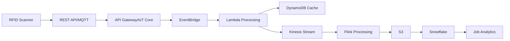
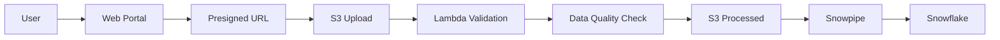

# Smart Manufacturing Data Hub Architecture Design Document v2.0

## Executive Summary

This document outlines the enhanced architecture design for a cloud-native, multi-tenant smart manufacturing data hub that enables real-time sensor data collection, processing, and visualization for 30-40 SMEs. The solution has been expanded to support machine utilization analytics, air quality monitoring, and job location tracking while maintaining a unified platform architecture.

### Key Objectives
- Support diverse sensor types: machine utilization, air quality, energy, and RFID tracking
- Process 2.6M-3.9M rows daily with additional event-driven data
- Deliver <5 minute latency for sensor KPIs, <1 second for real-time monitoring
- Enable secure multi-tenant data isolation across all use cases
- Support 20-40 concurrent users across 60-120 specialized dashboards
- Provide unified portal for all analytics and reporting needs

### Version History
- v1.0: Initial architecture for basic sensor monitoring
- v2.0: Enhanced to support MUA, AQMA, and Job Tracking use cases

---

## Architecture Overview

### High-Level Architecture Pattern
The solution implements a **Centralized Multi-Tenant Platform** with the following characteristics:
- Shared infrastructure with logical data separation
- Row-level security for tenant isolation
- Scalable ingestion pipeline supporting streaming, batch, and event-driven data
- Flexible analytics layer supporting multiple BI tools and custom visualizations
- Unified web portal for all user interactions

### Technology Stack
- **Cloud Provider**: AWS (Region: eu-west-2 London)
- **Data Warehouse**: Snowflake (SaaS, AWS-hosted)
- **Stream Processing**: Apache Flink on EMR / Kinesis Analytics
- **IoT Protocol**: MQTT v3/v5 via AWS IoT Core
- **Analytics**: QuickSight, PowerBI Embedded, Grafana, Custom D3.js
- **Application Framework**: React 18+ with TypeScript on AWS ECS Fargate
- **Authentication**: AWS Cognito with SSO and MFA support
- **Data Quality**: Great Expectations with AWS Glue Schema Registry

---

## Component Architecture

### 1. Data Sources Layer (Enhanced)

#### Machine Utilization Monitoring
- **Machine Sensors**
  - Frequency: 1 Hz data collection
  - Volume: 30-45 sensors per deployment
  - Protocol: LoRaWAN/MQTT
  - Metrics: Operating state, cycle counts, downtime events

- **Energy Monitoring Systems**
  - Frequency: 15-second intervals
  - Protocol: Modbus TCP/MQTT
  - Metrics: Voltage, Current, Power Factor, kWh consumption
  - Integration: Smart meters with real-time data streaming

#### Air Quality Management
- **Environmental Sensors**
  - Frequency: 1-minute intervals
  - Volume: 10-15 sensors per facility
  - Metrics: CO2, VOCs, PM1/2.5/4/10, Temperature, Humidity, Pressure
  - Protocol: MQTT/LoRaWAN
  - Thresholds: Configurable alerts for compliance

#### Job Location Tracking
- **RFID/Barcode Systems**
  - Type: Event-driven scanning
  - Volume: 500-2000 scans per day per facility
  - Protocol: HTTP/REST API or MQTT
  - Data: Location timestamps, product IDs, operator information
  - Locations: Complete, Punched, Waiting, Local Painting, Drying, Stored

#### Legacy Systems Integration
- **File Uploads**
  - Formats: CSV, XLSX, JSON, PDF, PNG
  - Volume: 5-50 GB per company
  - Frequency: Weekly to monthly batch uploads
  - Interface: Drag-and-drop portal with validation

#### Industrial IoT Platform
- **OpenSmartMonitor**
  - Industrial IoT monitoring solution
  - LoRaWAN gateway connectivity
  - Grafana-based visualization capabilities
  - Edge computing support

### 2. Ingestion & Routing Layer (Enhanced)

#### AWS IoT Core
- **Function**: MQTT message broker and device management
- **Protocol Support**: MQTT v3.1.1 and v5
- **Capabilities**:
  - Persistent connections with automatic reconnection
  - Device authentication via X.509 certificates
  - Device shadows for state management
  - Message retention and QoS levels
  - Device registry with metadata

#### IoT Rules Engine
- **Function**: Message routing, filtering, and transformation
- **Configuration**: 
  - Consolidated rule set for cost optimization
  - Topic-based routing for different sensor types
  - Error handling with DLQ
- **Actions**: 
  - Route to Kinesis Data Firehose
  - Trigger Lambda for immediate processing
  - Store to S3 for batch processing

#### API Gateway
- **Function**: REST API for file uploads and manual data submission
- **Features**: 
  - Request throttling and rate limiting
  - API key management with usage plans
  - Lambda integration for processing
  - Presigned URL generation for S3 uploads
  - WebSocket support for real-time updates

#### EventBridge
- **Function**: Event-driven orchestration
- **Use Cases**:
  - RFID scan event processing
  - Scheduled batch job triggers
  - Alert notification routing
  - Cross-service integration

#### Schema Registry
- **Technology**: AWS Glue Schema Registry
- **Functions**:
  - Schema versioning and evolution
  - Data contract enforcement
  - Compatibility checking
  - Metadata management

### 3. Processing & Transformation Layer (New)

#### Stream Processing
- **Apache Flink on EMR**
  - Real-time windowing for utilization calculations
  - Complex event processing for state detection
  - Session windows for job tracking
  - Low-latency aggregations (<1 second)
  - Exactly-once processing semantics

#### Lambda Functions
- **Data Transformation**:
  - Schema validation and type conversion
  - Data enrichment with metadata
  - Deduplication logic
  - Format normalization
- **Triggers**: 
  - Kinesis Data Firehose
  - S3 events
  - API Gateway
  - EventBridge rules
- **Runtime**: Python 3.11+ or Node.js 18+

#### Kinesis Data Firehose
- **Buffer Configuration**:
  - Size: 10 MB (compressed GZIP)
  - Time: 60 seconds (whichever comes first)
- **Function**: Stream buffering, compression, and format conversion
- **Output**: S3 staging buckets with Parquet format

#### Data Quality Framework
- **Great Expectations**:
  - Data validation rules
  - Profiling and documentation
  - CI/CD integration for data pipelines
- **Data Lineage**: Apache Atlas or DataHub integration
- **Monitoring**: Data quality dashboards and alerts

#### Machine Learning Pipeline
- **AWS SageMaker**:
  - Anomaly detection for machine states
  - Predictive maintenance models
  - Air quality forecasting
  - Production optimization algorithms
- **Model Management**:
  - Model registry and versioning
  - A/B testing framework
  - Automated retraining pipelines

#### Batch Processing
- **AWS Batch**:
  - Scheduled ETL jobs
  - Report generation
  - Data archival processes
  - Cost optimization through spot instances

#### S3 Data Lake
- **Structure**: 
  - `/raw/tenant-id/source-type/year/month/day/hour/`
  - `/processed/tenant-id/use-case/year/month/day/`
  - `/archive/tenant-id/year/`
- **Features**:
  - Lifecycle policies for data tiering (hot/warm/cold)
  - Encryption at rest (SSE-S3 or SSE-KMS)
  - Event notifications to SQS/SNS
  - VPC Endpoint for private access
  - Intelligent tiering for cost optimization

### 4. Data Platform (Snowflake) - Enhanced

#### Storage Integration
- **IAM Role-based authentication** to S3
- **External stages** for multiple data sources
- **Secure access** without embedded credentials
- **Cross-region replication** for DR

#### Snowpipe (Enhanced)
- **Auto-ingest**: Triggered by SQS notifications
- **Near real-time**: <1 minute from file arrival
- **Error handling**: Failed file reprocessing
- **Monitoring**: Pipe status and performance metrics

#### Enhanced Data Architecture
```sql
-- Enhanced multi-tenant sensor readings table
CREATE TABLE sensor_readings_v2 (
    tenant_id VARCHAR(50) NOT NULL,
    sensor_id VARCHAR(100) NOT NULL,
    sensor_type VARCHAR(50) NOT NULL, -- 'MACHINE', 'AIR_QUALITY', 'ENERGY', 'RFID'
    location_id VARCHAR(100),
    timestamp TIMESTAMP_NTZ NOT NULL,
    
    -- Flexible metric storage
    metric_name VARCHAR(100) NOT NULL,
    metric_value VARIANT NOT NULL,
    unit VARCHAR(20),
    
    -- Context and quality
    device_metadata VARIANT,
    quality_score FLOAT,
    
    -- Data lineage
    record_source VARCHAR(255),
    load_timestamp TIMESTAMP_NTZ DEFAULT CURRENT_TIMESTAMP(),
    processing_timestamp TIMESTAMP_NTZ,
    job_id VARCHAR(100),
    
    PRIMARY KEY (tenant_id, sensor_id, timestamp, metric_name)
) CLUSTER BY (tenant_id, sensor_type, timestamp);

-- Job tracking table for RFID data
CREATE TABLE job_tracking (
    tenant_id VARCHAR(50) NOT NULL,
    job_id VARCHAR(100) NOT NULL,
    product_id VARCHAR(100),
    product_variant VARCHAR(100),
    location VARCHAR(100) NOT NULL,
    scan_timestamp TIMESTAMP_NTZ NOT NULL,
    duration_seconds INTEGER,
    operator_id VARCHAR(50),
    metadata VARIANT,
    
    PRIMARY KEY (tenant_id, job_id, location, scan_timestamp)
) CLUSTER BY (tenant_id, DATE_TRUNC('day', scan_timestamp));

-- Machine utilization aggregated view
CREATE MATERIALIZED VIEW machine_utilization_hourly AS
SELECT 
    tenant_id,
    sensor_id as machine_id,
    DATE_TRUNC('hour', timestamp) as hour,
    AVG(CASE WHEN metric_name = 'utilization' THEN metric_value::FLOAT END) as avg_utilization,
    SUM(CASE WHEN metric_name = 'energy_kwh' THEN metric_value::FLOAT END) as total_energy,
    COUNT(DISTINCT CASE WHEN metric_name = 'state_change' THEN metric_value END) as state_changes,
    MAX(CASE WHEN metric_name = 'cycle_count' THEN metric_value::INTEGER END) as cycle_count
FROM sensor_readings_v2
WHERE sensor_type = 'MACHINE'
GROUP BY 1,2,3;

-- Air quality index calculation view
CREATE VIEW air_quality_current AS
SELECT 
    tenant_id,
    location_id,
    MAX(CASE WHEN metric_name = 'co2_ppm' THEN metric_value::FLOAT END) as co2_level,
    MAX(CASE WHEN metric_name = 'voc_ppb' THEN metric_value::FLOAT END) as voc_level,
    MAX(CASE WHEN metric_name = 'pm25_ugm3' THEN metric_value::FLOAT END) as pm25_level,
    MAX(CASE WHEN metric_name = 'temperature_c' THEN metric_value::FLOAT END) as temperature,
    MAX(CASE WHEN metric_name = 'humidity_pct' THEN metric_value::FLOAT END) as humidity,
    MAX(timestamp) as last_reading,
    -- Calculate AQI based on multiple factors
    CASE 
        WHEN MAX(CASE WHEN metric_name = 'pm25_ugm3' THEN metric_value::FLOAT END) > 55 THEN 'Poor'
        WHEN MAX(CASE WHEN metric_name = 'co2_ppm' THEN metric_value::FLOAT END) > 1000 THEN 'Moderate'
        ELSE 'Good'
    END as air_quality_index
FROM sensor_readings_v2
WHERE sensor_type = 'AIR_QUALITY'
  AND timestamp > DATEADD(minute, -5, CURRENT_TIMESTAMP())
GROUP BY 1,2;

-- Row Access Policy for Multi-tenancy
CREATE OR REPLACE ROW ACCESS POLICY tenant_isolation AS 
    (tenant_id VARCHAR) RETURNS BOOLEAN ->
    CURRENT_ROLE() IN ('ADMIN_ROLE') 
    OR tenant_id = CURRENT_SESSION().tenant_id;

-- Apply policy to all tables
ALTER TABLE sensor_readings_v2 ADD ROW ACCESS POLICY tenant_isolation ON (tenant_id);
ALTER TABLE job_tracking ADD ROW ACCESS POLICY tenant_isolation ON (tenant_id);
```

#### Compute Resources (Optimized)
- **Real-time Warehouse**: Small (2 credits/hour), always on for streaming
- **ETL Warehouse**: Medium (4 credits/hour), auto-suspend 60s
- **Analytics Warehouse**: Large (8 credits/hour), auto-suspend 300s
- **Developer Warehouse**: X-Small (1 credit/hour), auto-suspend 60s
- **ML Warehouse**: X-Large (16 credits/hour), auto-suspend 60s

#### Data Organization
- **Raw Layer**: Time-series data as received, partitioned by date
- **Staging Layer**: Validated and cleansed data with quality scores
- **Aggregation Layer**: Pre-computed metrics at various granularities
- **Analytics Layer**: Business-ready datasets and data marts
- **Archive Layer**: Historical data with compression

### 5. Analytics & Visualization Layer (Enhanced)

#### Dashboard Categories

##### Operational Dashboards
- **Machine Utilization Monitoring**:
  - Real-time utilization rates
  - State transition analysis
  - Energy consumption tracking
  - Downtime analysis
  - OEE calculations

##### Environmental Dashboards
- **Air Quality Management**:
  - Real-time AQI display
  - Particle concentration trends
  - VOC level monitoring
  - Temperature/humidity heatmaps
  - Compliance reporting

##### Production Analytics
- **Job Location Tracking**:
  - Production flow visualization
  - Bottleneck identification
  - Cycle time analysis
  - Product variant comparison
  - Inventory tracking

#### BI Tool Configuration

##### QuickSight (Primary)
- **Deployment**: Embedded analytics with SPICE
- **Multi-tenancy**: Row-level security using tags and groups
- **Features**:
  - Paginated reports
  - ML insights and forecasting
  - Email scheduling
  - Mobile responsive dashboards
- **Cost Optimization**: SPICE refresh scheduling

##### PowerBI Embedded
- **Deployment**: Service principal authentication
- **Multi-tenancy**: Workspace isolation per tenant
- **Features**:
  - Custom visuals marketplace
  - Real-time streaming datasets
  - Natural language Q&A
  - Advanced DAX calculations

##### Grafana (Operational)
- **AWS Managed Grafana**:
  - Real-time monitoring
  - Alert management
  - Custom plugins for manufacturing KPIs
  - Integration with Prometheus metrics

##### Custom Visualizations
- **D3.js Components**:
  - Sankey diagrams for production flow
  - Custom gauge charts for KPIs
  - Interactive floor plan overlays
  - Real-time animation effects

##### Snowsight
- **Native Snowflake Interface**:
  - SQL worksheet sharing
  - Data exploration tools
  - Query performance analysis
  - Collaboration features

### 6. Web Portal Architecture (New)

#### Frontend Architecture
- **Framework**: React 18+ with TypeScript
- **State Management**: Redux Toolkit with RTK Query
- **UI Components**: Material-UI v5 with custom theme
- **Charts**: Recharts + D3.js for custom visualizations
- **Build Tools**: Vite for fast development
- **Testing**: Jest + React Testing Library

#### Portal Features

##### Dashboard Hub
- **Centralized Dashboard Catalog**:
  - Searchable dashboard repository
  - Categorization by use case
  - Favorites and recent dashboards
  - Dashboard versioning
- **Embedded Analytics**:
  - iFrame embedding with security tokens
  - Dynamic parameter passing
  - Cross-dashboard navigation
  - Print and export capabilities

##### Data Management Center
- **File Upload Interface**:
  - Drag-and-drop with progress tracking
  - File validation and preview
  - Batch upload support
  - Upload history and status
- **Data Quality Monitor**:
  - Validation rule results
  - Data profiling summaries
  - Anomaly detection alerts

##### Alert Management System
- **Configuration**:
  - Threshold-based alerts
  - Anomaly detection alerts
  - Scheduled checks
  - Alert templates
- **Notification Channels**:
  - Email with rich formatting
  - SMS for critical alerts
  - In-app notifications
  - Slack/Teams integration
- **Alert Analytics**:
  - Alert frequency analysis
  - False positive tracking
  - Response time metrics

##### Report Builder
- **Self-Service Capabilities**:
  - Drag-and-drop report designer
  - Template library
  - Custom calculations
  - Data source selection
- **Scheduling**:
  - Cron-based scheduling
  - Event-triggered reports
  - Distribution lists
  - Format options (PDF, Excel, CSV)

##### Admin Console
- **Tenant Management**:
  - Tenant provisioning
  - Resource allocation
  - Usage monitoring
  - Billing integration
- **User Management**:
  - Role-based access control
  - User provisioning/deprovisioning
  - Activity logging
  - Password policies

#### Backend Architecture
- **API Layer**: Node.js with Express or FastAPI (Python)
- **Caching**: Redis on ElastiCache
- **Queue**: SQS for async processing
- **Search**: OpenSearch for dashboard/report search

#### Multi-Tenant UI Isolation
- **Tenant Theming**: 
  - Custom logos and colors
  - Branded login pages
  - White-label options
- **Dynamic Menu Generation**:
  - Feature flags per tenant
  - Role-based menu items
  - Custom navigation flows
- **Data Isolation**:
  - JWT tokens with tenant claims
  - API-level tenant filtering
  - Separate cache namespaces

### 7. Security Architecture (Enhanced)

#### Network Security
- **VPC Design**:
  - CIDR: 10.0.0.0/16
  - Public subnets: ALB, NAT Gateways
  - Private subnets: Application and processing workloads
  - Database subnets: RDS and ElastiCache
  - VPC Endpoints: S3, Snowflake PrivateLink, ECR, Secrets Manager

- **Security Controls**:
  - AWS WAF with custom rules for application protection
  - AWS Shield Standard for DDoS protection
  - Security Groups with least privilege
  - NACLs for subnet-level control
  - VPC Flow Logs to S3 for analysis
  - AWS Network Firewall for advanced filtering

#### Data Security
- **Encryption**:
  - At rest: S3 SSE-KMS, Snowflake automatic encryption
  - In transit: TLS 1.3 for all connections
  - Field-level encryption for sensitive data
  - Key rotation every 90 days
  - Customer-managed keys option

- **Access Control**:
  - IAM roles with MFA enforcement
  - Service accounts with temporary credentials
  - API keys with rotation policy
  - Row-level security in Snowflake
  - Column-level masking for PII

#### Application Security
- **Authentication & Authorization**:
  - AWS Cognito with MFA requirement
  - SAML 2.0 and OAuth 2.0 support
  - Session management with refresh tokens
  - Password complexity requirements
  - Account lockout policies

- **API Security**:
  - Rate limiting per tenant
  - API versioning
  - Request signing
  - Input validation
  - CORS configuration

#### Compliance & Audit
- **Logging**:
  - AWS CloudTrail for API calls
  - Application logs to CloudWatch
  - Database query logs
  - Access logs for all services
- **Compliance Features**:
  - GDPR data retention and deletion
  - ISO 27001 controls
  - SOC 2 Type II alignment
  - Manufacturing industry standards
- **Security Monitoring**:
  - AWS Security Hub centralization
  - GuardDuty for threat detection
  - Macie for data classification
  - Regular penetration testing

---

## Multi-Tenancy Strategy (Enhanced)

### Data Isolation Model
**Hybrid Approach: MTT with Optional Dedicated Resources**

#### Standard Tenants (MTT Pattern)
- Shared tables with tenant_id column
- Row Access Policies for isolation
- Shared compute resources
- Cost-effective for smaller tenants

#### Premium Tenants (Dedicated Resources)
- Separate Snowflake schemas
- Dedicated compute warehouses
- Custom retention policies
- Priority support SLA

### Performance Isolation
- **Snowflake Resource Monitors**:
  - Credit quotas per tenant
  - Alert thresholds
  - Automatic suspension for overuse
- **Query Priorities**:
  - Queue management
  - Timeout settings
  - Concurrency limits

### Dashboard Isolation
- **QuickSight**: 
  - Namespace isolation
  - Tag-based RLS
  - SPICE dataset separation
- **PowerBI**: 
  - Workspace per tenant
  - Capacity management
  - Row-level security in models
- **Portal**: 
  - URL-based tenant identification
  - Separate subdomains option
  - Cookie/session isolation

### Cost Attribution
- **Detailed Tracking**:
  - Compute usage per tenant
  - Storage consumption
  - Data transfer costs
  - API call counts
- **Billing Integration**:
  - Usage reports generation
  - Chargeback mechanisms
  - Cost optimization recommendations

---

## Data Flow Architecture (Updated)

### Real-time Sensor Data Flow

```mermaid
graph LR
    A[Sensors] --> B[LoRaWAN/MQTT]
    B --> C[AWS IoT Core]
    C --> D[IoT Rules]
    D --> E[Kinesis Firehose]
    E --> F[Lambda Transform]
    F --> G[S3 Parquet]
    G --> H[SQS Notification]
    H --> I[Snowpipe]
    I --> J[Snowflake]
    J --> K[Aggregations]
    K --> L[BI Tools]
    L --> M[Web Portal]
```


### RFID Job Tracking Flow


### Batch File Upload Flow


---

## Implementation Roadmap (Revised)

### Phase 1: Foundation & Core Platform (Weeks 1-4)
- [ ] AWS account setup with enhanced security
- [ ] VPC and network architecture deployment
- [ ] Snowflake account with multi-tenant schema
- [ ] Basic IoT Core and API Gateway setup
- [ ] S3 bucket structure with lifecycle policies
- [ ] Initial React portal framework
- [ ] CI/CD pipeline setup

### Phase 2: Data Ingestion & Processing (Weeks 5-8)
- [ ] Deploy Kinesis Firehose with transformations
- [ ] Implement Schema Registry
- [ ] Setup Flink for stream processing
- [ ] Configure Snowpipe for auto-ingestion
- [ ] Implement data quality framework
- [ ] Deploy EventBridge for orchestration

### Phase 3: Use Case Implementation (Weeks 9-12)
- [ ] Machine Utilization: Energy monitoring integration
- [ ] Air Quality: Environmental sensor pipeline
- [ ] Job Tracking: RFID system integration
- [ ] Create base dashboard templates
- [ ] Implement alert management system
- [ ] Portal features for each use case

### Phase 4: Analytics & Visualization (Weeks 13-16)
- [ ] Deploy QuickSight with embedded analytics
- [ ] Configure PowerBI workspaces (if selected)
- [ ] Implement Grafana for operational metrics
- [ ] Create custom D3.js visualizations
- [ ] Build report generation system
- [ ] Self-service analytics tools

### Phase 5: Advanced Features & Optimization (Weeks 17-20)
- [ ] Deploy ML models for anomaly detection
- [ ] Implement predictive maintenance
- [ ] Advanced visualization components
- [ ] Performance optimization
- [ ] Cost optimization implementation
- [ ] Documentation and training

### Phase 6: Production Hardening (Weeks 21-24)
- [ ] Security audit and penetration testing
- [ ] Load testing and performance tuning
- [ ] Disaster recovery setup
- [ ] Monitoring and alerting enhancement
- [ ] SLA implementation
- [ ] Go-live preparation

---

## Capacity Planning (Updated)

### Storage Requirements
- **Daily Volume**: 
  - Sensor data: 105-157 MB compressed
  - RFID events: 10-20 MB
  - Energy data: 20-30 MB
  - Total: ~200 MB/day compressed
- **Monthly Growth**: 6-8 GB total
- **Annual Projection**: 75-100 GB raw data
- **With Aggregations**: ~200 GB total

### Compute Requirements
- **Snowflake Credits**: 
  - Initial: 200-300 credits/month
  - Full scale: 500-800 credits/month
  - ML workloads: +200 credits/month
  
- **AWS Costs (Monthly)**:
  - IoT Core: $100-200 (based on messages)
  - S3 Storage: $50-100
  - Compute (Lambda/ECS/EMR): $500-800
  - API Gateway: $50-100
  - Kinesis: $100-200
  - Other services: $200-400
  - **Total**: $1,000-1,800/month

### User Capacity
- **Named Users**: 20-40 across all tenants
- **Concurrent Users**: 15-20 peak
- **Dashboard Count**: 60-120 active
- **Reports Generated**: 100-200/month
- **API Calls**: 50,000/day estimated
- **Alert Rules**: 200-300 active

---

## Monitoring & Operations (Enhanced)

### Key Performance Indicators

#### Data Pipeline KPIs
- Ingestion latency: <5 seconds for streaming, <1 minute for batch
- Pipeline success rate: >99.9% target
- Data quality score: >95% target
- Schema compliance: 100% target

#### Application KPIs
- Dashboard load time: <3 seconds p95
- API response time: <500ms p95
- Portal availability: 99.9% uptime
- Alert delivery time: <30 seconds

#### Business KPIs
- Machine utilization improvement: Track % increase
- Air quality compliance: % time within limits
- Job cycle time reduction: Track improvement
- Cost per tenant: Monitor trends

### Monitoring Stack
- **Infrastructure**: CloudWatch with custom dashboards
- **Application**: APM with X-Ray or DataDog
- **Data Quality**: Great Expectations dashboards
- **Business Metrics**: Custom Snowflake dashboards
- **Log Aggregation**: CloudWatch Logs Insights
- **Alerting**: SNS + PagerDuty integration

### Operational Procedures
- **Incident Response**: Defined runbooks
- **Change Management**: GitOps approach
- **Backup & Recovery**: Automated daily backups
- **Maintenance Windows**: Scheduled with notifications
- **Performance Reviews**: Weekly analysis
- **Cost Reviews**: Monthly optimization

---

## Risk Mitigation (Updated)

| Risk | Probability | Impact | Mitigation Strategy |
|------|------------|--------|-------------------|
| Data pipeline failure | Low | High | Multiple retry mechanisms, DLQ, circuit breakers, monitoring |
| Sensor connectivity issues | Medium | Medium | Edge buffering, store-and-forward, connection monitoring |
| Cost overrun | Medium | Medium | Resource monitors, budget alerts, auto-scaling limits |
| Security breach | Low | Critical | Defense in depth, encryption, regular audits, penetration testing |
| Vendor lock-in | Medium | Low | Open standards, abstraction layers, multi-cloud ready |
| Scalability issues | Low | High | Auto-scaling, performance testing, capacity planning |
| Data quality issues | Medium | High | Validation rules, profiling, monitoring, data contracts |
| Multi-tenant data leakage | Low | Critical | Row-level security, testing, audit logging |
| Compliance violations | Low | High | Automated compliance checks, audit trails |
| ML model drift | Medium | Medium | Model monitoring, automated retraining, A/B testing |

---

## Cost Optimization Strategies (Enhanced)

### Storage Optimization
- **Data Tiering**:
  - Hot: Last 30 days in Snowflake
  - Warm: 30-90 days in S3 Parquet
  - Cold: >90 days in S3 Glacier
- **Compression**: 
  - GZIP for streaming data
  - Parquet for analytical workloads
  - Zstandard for archives
- **Deduplication**: Remove redundant data at ingestion

### Compute Optimization
- **Snowflake**:
  - Auto-suspend aggressive settings
  - Multi-cluster warehouses for concurrency
  - Query optimization and result caching
  - Zero-copy cloning for dev/test
- **AWS**:
  - Spot instances for batch processing
  - Reserved instances for predictable workloads
  - Lambda with ARM processors
  - Right-sizing based on utilization

### Data Transfer Optimization
- **VPC Endpoints**: Eliminate data transfer charges
- **CloudFront**: Cache static content
- **Direct Connect**: For high-volume transfers
- **Compression**: Reduce transfer volumes

---

## Recommendations & Best Practices

### Immediate Actions
1. **Technology Selection**:
   - Confirm QuickSight as primary BI tool
   - Evaluate need for PowerBI Embedded
   - Select between Flink and Kinesis Analytics
   
2. **Security Setup**:
   - Implement MFA for all users
   - Configure WAF rules
   - Setup penetration testing schedule
   
3. **Data Governance**:
   - Define data retention policies
   - Create data classification scheme
   - Establish data quality SLAs

### Strategic Considerations
1. **Scalability**: Design for 10x growth from day one
2. **Flexibility**: Use microservices and event-driven architecture
3. **Observability**: Implement comprehensive monitoring early
4. **Cost Management**: Set up cost allocation tags immediately
5. **ML Readiness**: Design data models for future ML use cases
6. **Compliance**: Build compliance into the architecture

### Success Criteria
- ✅ Support all three use cases on single platform
- ✅ Meet <5 minute latency for all analytics
- ✅ Achieve 99.9% platform availability
- ✅ Enable complete multi-tenant isolation
- ✅ Deliver self-service capabilities
- ✅ Maintain costs within budget
- ✅ Pass security audit requirements

---

## Appendices

### A. Technology Alternatives Evaluated
| Component | Selected | Alternative | Rationale |
|-----------|----------|-------------|-----------|
| Stream Processing | Flink on EMR | Kinesis Analytics | More flexibility, better windowing |
| Data Warehouse | Snowflake | Redshift | Better multi-tenancy, consumption pricing |
| BI Tool | QuickSight | Tableau | Cost-effective, native AWS integration |
| Portal Framework | React | Angular | Larger ecosystem, better performance |
| Message Queue | Kinesis | Kafka | Managed service, less operational overhead |

### B. Reference Architecture Patterns
- AWS IoT Reference Architecture
- Snowflake Multi-Tenant Design Patterns
- AWS Well-Architected Framework
- Manufacturing Industry Reference Architecture
- Real-time Analytics on AWS

### C. Glossary
- **AQMA**: Air Quality Management Analytics
- **MUA**: Machine Utilization Analytics
- **MTT**: Multi-Tenant Table
- **OEE**: Overall Equipment Effectiveness
- **RFID**: Radio-Frequency Identification
- **RLS**: Row-Level Security
- **SPICE**: Super-fast, Parallel, In-memory Calculation Engine
- **VOC**: Volatile Organic Compounds

### D. Useful Resources
- [AWS IoT Core Documentation](https://docs.aws.amazon.com/iot/)
- [Snowflake Multi-Tenant Patterns](https://docs.snowflake.com/guides/multi-tenancy)
- [React Best Practices](https://react.dev/learn)
- [Manufacturing KPIs Guide](https://www.oee.com/)

---

## Document Control

- **Version**: 2.0
- **Date**: October 2024
- **Author**: Architecture Team
- **Status**: Final - Ready for Implementation
- **Review Date**: January 2025
- **Distribution**: Project Stakeholders

---

*This document represents the enhanced architectural design incorporating machine utilization, air quality monitoring, and job location tracking requirements. It supersedes version 1.0 and should be used as the primary reference for implementation.*