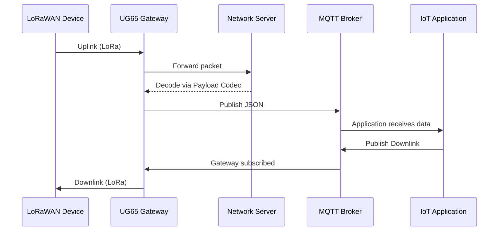

# UG65 LoRaWAN Gateway MQTT Integration Guide

## 1. MQTT Topic Structure

### Pattern A — Application Scoped Topics
```
uplink:    lorawan/<appId>/uplink
downlink:  lorawan/<appId>/downlink
join:      lorawan/<appId>/join
ack:       lorawan/<appId>/ack
error:     lorawan/<appId>/error
```

### Pattern B — Device Scoped Topics
```
uplink:    lorawan/dev/<devEUI>/uplink
downlink:  lorawan/dev/<devEUI>/downlink
join:      lorawan/dev/<devEUI>/join
ack:       lorawan/dev/<devEUI>/ack
error:     lorawan/dev/<devEUI>/error
```

---

## 2. MQTT Payload Examples

### Uplink Example
```json
{
  "applicationId": "cloud",
  "deviceEUI": "24E124707E043923",
  "deviceName": "AM308",
  "time": "2025-12-04T16:12:00Z",
  "fPort": 85,
  "fCntUp": 969,
  "adr": false,
  "confirmedUplink": false,
  "data": {
    "temperature": 21.8,
    "humidity": 48.5,
    "co2": 420,
    "battery": 92
  },
  "rx": {
    "gatewayEUI": "24E124FFFEF35F39",
    "frequency": 923.2,
    "dataRate": "SF9BW125",
    "coderate": "4/5",
    "rssi": -102,
    "snr": -13.2
  }
}
```

### Downlink Example
```json
{
  "deviceEUI": "24E124707E043923",
  "fPort": 85,
  "confirmed": false,
  "payloadFormat": "hex",
  "payload": "01755C03673401"
}
```

---

## 3. Payload Codec (JavaScript ES5)
```javascript
function Decode(fPort, bytes) {
  var obj = {};
  for (var i = 0; i < bytes.length;) {
    var tag = bytes[i++];
    if (tag === 0x01) { var v = (bytes[i++] << 8) | bytes[i++]; obj.temperature = v / 10.0; }
    else if (tag === 0x02) { var v2 = (bytes[i++] << 8) | bytes[i++]; obj.humidity = v2 / 10.0; }
    else if (tag === 0x03) { var v3 = (bytes[i++] << 8) | bytes[i++]; obj.co2 = v3; }
    else if (tag === 0x04) { obj.battery = bytes[i++]; }
    else { break; }
  }
  return obj;
}

function Encode(fPort, obj) {
  var out = [];
  if (obj.hasOwnProperty("led")) {
    out.push(0x10, obj.led ? 0x01 : 0x00);
  }
  return out;
}
```

---

## 4. Configuration Checklist
- Enable **Network Server** mode.
- Create **Application** and enable **Metadata**.
- Configure **MQTT Integration**: broker, TLS, QoS, retain, topics.
- Attach **Payload Codec** to Application or Device.
- Test uplink/downlink via **Packets** page.

---

## 5. Security & Reliability
- Use **TLS** with CA-signed certificates.
- QoS 1 recommended for reliability.
- Enable **Data Retransmission** for MQTT and Packet Forwarder.

---

## 6. End-to-End Flow Diagram

